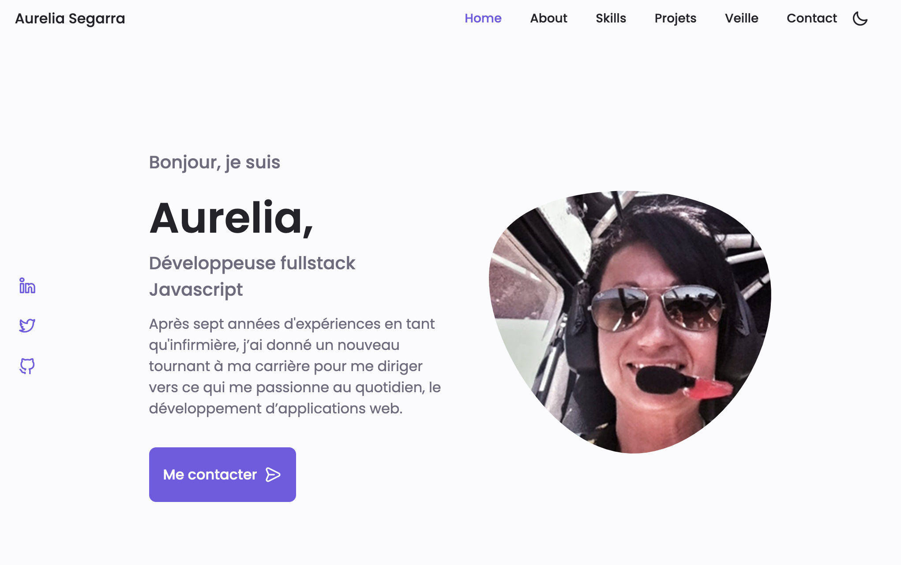

#  :computer: PortfolioV3

## Create a portfolio to show differents projects realized during my BTS SIO SLAM 

## Illustration 📸

## Language/tools 🛠
- HTML5 / CSS3
- Javascript vanilla
  

## Goals 🏔
- Structure and organize UI components
- UX / UI
  

## How to use 🛠

### ⚙️ Launch 
- Open with Live Server 
- Deployed with Netlify and visible here : https://portfoliobtsaureliasegarra.netlify.app

## Status 🎯
Project completed

## Context 🗓
Project developed as a junior web developer during my BTS SIO SLAM
